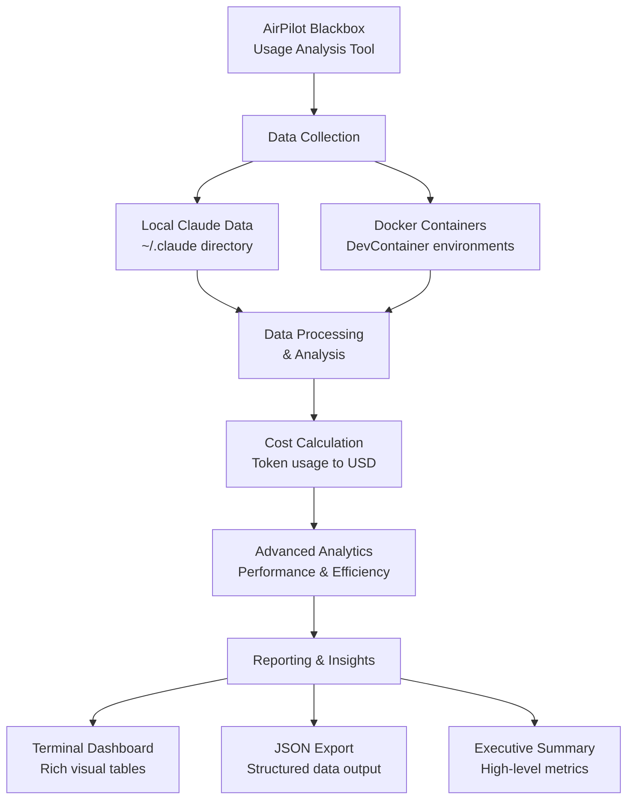
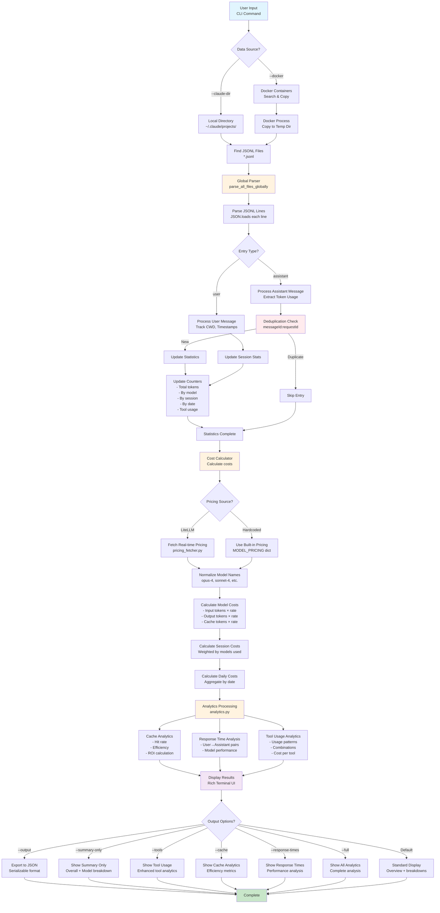

# AirPilot Blackbox Flowchart

## Overview

**AirPilot Blackbox** is a comprehensive Claude AI usage analysis and cost tracking tool that processes Claude conversation logs and provides detailed analytics with cost calculations.

### Key Functionality

- Analyzes Claude usage logs from `~/.claude` or Docker containers
- Calculates accurate costs using real-time or hardcoded pricing
- Provides advanced analytics (cache efficiency, response times, tool usage)
- Supports session deduplication across multiple sources
- Exports results to JSON with rich terminal UI

## Flow Description

These flowcharts illustrate the complete data processing pipeline of AirPilot Blackbox, from input sources through parsing, analysis, cost calculation, and output generation.

## FlowChart 10,000 foot

**Bottom Line**: Turn AI spending visibility into cost savings.

## Flowchart Summary

## Flowchart System Architecture

### Key Business Benefits

- **Cost Transparency**: Real-time cost tracking and forecasting
- **Usage Insights**: Detailed analytics on AI tool adoption and efficiency
- **Performance Monitoring**: Response time and cache efficiency metrics
- **Multi-Environment Support**: Works across local and containerized development
- **ROI Analysis**: Quantify AI investment returns and optimization opportunities

### Key Processing Stages

1. **Input Processing**: Handles both local `~/.claude` directories and Docker container sources
2. **File Discovery**: Locates all JSONL files containing Claude conversation logs
3. **Parsing & Deduplication**: Processes JSON entries with global message deduplication
4. **Statistics Collection**: Aggregates usage data by model, session, date, and tools
5. **Cost Calculation**: Applies real-time or hardcoded pricing to usage statistics
6. **Analytics Processing**: Generates advanced metrics for cache, response times, and tools
7. **Output Generation**: Displays results via rich terminal UI or exports to JSON
